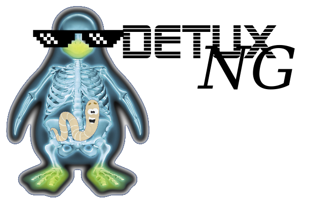

# (Beta stage)

## The Multiplatform Linux Sandbox
DetuxNG is a malware sandbox developed for daily use by analysts.  Based on QEMU and using SSH for system control, DetuxNG can support environments of multiple architectures (x86, x64, ARM, MIPS, etc) and operating systems (windows, linux, android).  

DetuxNG is not designed for enterprise use. 

### Introduction:
DetuxNG is a sandbox developed to do magic

### Setup:

1: Create Virtual Machines
 - Bash scripts will do net installs
 - power off vm
 - take snapshot

Detux requires specific machine name format

(Win10):
    Enable SSH server
    https://docs.microsoft.com/en-us/windows-server/administration/openssh/openssh_install_firstuse
    https://winaero.com/enable-openssh-server-windows-10/
    
2: Verify working
 - virsh list --all              # List VMs
 - virsh net-dhcp-leases default # Get IPs of hosts

3: Auto-generate config?

### Contributers / Thanks:
Following is a list of early developers and contributors that we'd like to thank for their help.
- Vikas Iyengar - The brain ( [dudeintheshell](https://github.com/dudeintheshell) , email: iyengar.vikas@gmail.com ) 
- Muslim Koser - Technichal thought works (muslimk@gmail.com)
- Rahul Binjve - Help in pcap parsing ([@c0dist](https://github.com/c0dist), [twitter](https://twitter.com/c0dist))
- Amey Gat - Help in pcap parsing ([ameygat](https://github.com/ameygat), ameygat@gmail.com )
- Thanks to Aurélien Jarno (@aurel32) (https://www.aurel32.net/) for the pre-built VM images.
- Joe Stewart (@joestewart71) for developing Truman years ago and the immeasurable amount he has  done. 
